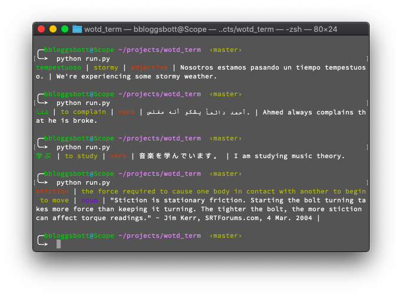

# wotd
Word of the Day fetcher that supports multiple languages (25). 


*Changes were made to the config file to generate the different results*

In it's first run, it creates a `.wotd.config` file in your hone directory. Edit this file to configure the fetcher.

Sample `.wotd.config`
```yaml
lang: en
meaning_color: yellow
output_pattern: '[wotd_word] | [wotd_meaning] | [wotd_pos] | [wotd_example] | [wotd_example_en]'
pos_color: red
word_color: green
```

You can edit the pattern of the output and also set the colors for some parts of the output.

To set the language of the word fetched, set the `lang` field in the config to one of the following.

|Code|Language|
|----|----|
|ar|Arabic|
|ban|balinese|
|zh|Chinese|
|nl|Dutch|
|en|English|
|eo|Esperanto|
|fr|French|
|de|German|
|he|Hebrew|
|hi|Hindi|
|id|Indonesian|
|ga|Irish|
|it|Italian|
|ja|Japanese|
|ko|Korean|
|la|Latin|
|no|Norwegian|
|ps|Pashto|
|pl|Polish|
|pt|Brazilian Portuguese|
|ru|Russian|
|es|Spanish|
|sv|Swedish|
|tr|Turkish|
|ur|Urdu|

Word of the Day Sources [Merriam Webster](https://www.merriam-webster.com/) and [Transparent Language](https://www.transparent.com/)